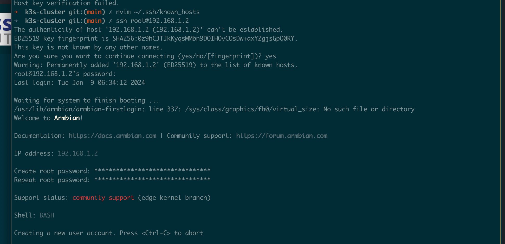

# **Create k3s cluster on OrangePi 5 plus devices with ansible** 

# Manual stuff (TODO: do it with playbooks.. someday)
It's supposed that you have SD card inserted as well as mounted nvme ssd disks mounted in the back of OrangePi 5 plus
The whole idea is to prepare and boot from SD card and move Armbian to the /dev/nvme0n1 sdd. 

## Copy to sdcard (WARNING: doublecheck disk device name !!! )
```bash
# on osX check out the disk name with diskutil list command 
# on linux/bsd/unix you can use lsblk or parted or gsdisk or other like cdisk fdisk etc.

# create bootable sd card
sudo dd if=Armbian_23.11.1_Orangepi5-plus_bookworm_edge_6.7.0-rc1_minimal.img of=/dev/disk2 bs=1m status=progress
```

### Insert and Boot with SD card

### List devices lsblk

```bash
lsblk
```
### DD from sd to nvme. WARNING: Ensure device name!!!
```bash
# root
sudo su -
# NOTE: option bs=1M is different from osX one (bs=1m) if you use it. 
dd if=/dev/mmcblk1 of=/dev/nvme0n1 bs=1M status=progress
```
### Edit partition 2 (nvme0n1p2 ) on nvme device in order to extend it 
```bash
parted /dev/nvme0n1 
list partitions - type: "p"
resizepart - type: "resizepart" "number_of_partition"
set how mutch - type: 100%
```

### Check and resize fs 
```bash
e2fsck -f /dev/nvme0n1p2
resize2fs /dev/nvme0n1p2
```
### List UUIDs
```bash
blkid
```
### Check out that UUIDs of sdcard and nvme are the same.

### Change UUID 
```bash
tune2fs -O metadata_csum_seed -U random /dev/mmcblk1p2
e2label /dev/nvme0n1p1 bootfs
```

### Reboot 
After reboot you will have /boot mounted from sdcard and / mounted as /dev/nvme0n1p1

### Edit /etc/fstab in /dev/nvme0n1p1 (i.e. "/")
blkid and get UUID for /dev/nvme0n1p1
change that in fstab with above one.

### Reboot 


## Running Ansible Playbooks
### Download armbian and check sha (localhost is osx TODO: for other osses) 
```ansible
ansible-playbook -i ansible/inventory/hosts.ini ansible/playbooks/001_download_verify_image.yml
```

### Write image to sdcard
This to be achiavable you need to set IMAGE_PATH and DISK_DEVICE.
WARNING: Make sure that disk is not wrong one!!
```ansible 
ansible-playbook -i ansible/inventory/hosts.ini ansible/playbooks/002_dd_image_to_local_sd.yml -e "IMAGE_PATH=$PWD/Armbian_23.11.1_Orangepi5-plus_bookworm_edge_6.7.0-rc1_minimal.img.xz DISK_DEVICE=/dev/disk2" --ask-become-pass
```
### Initial Config --> 
Armbian


```ansible-playbook
## Rebooting only k3s-worker-01 node
ansible-playbook -i ansible/inventory/hosts.ini ansible/playbooks/10_reboot.yml --private-key=~/.ssh/id_rsa -K --limit="k3s-worker-01"

```
