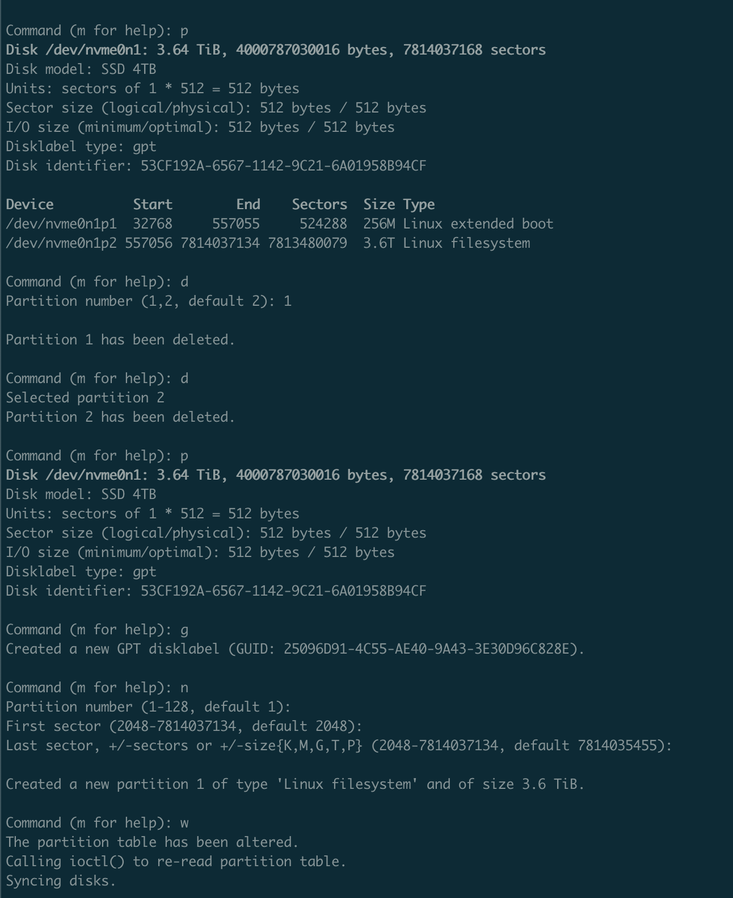
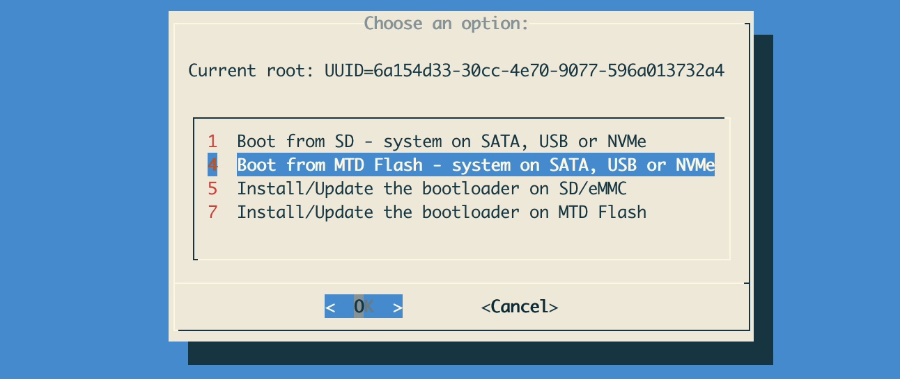
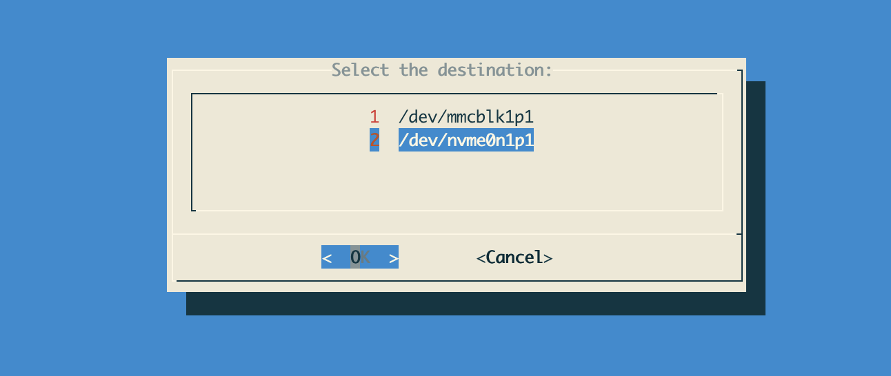
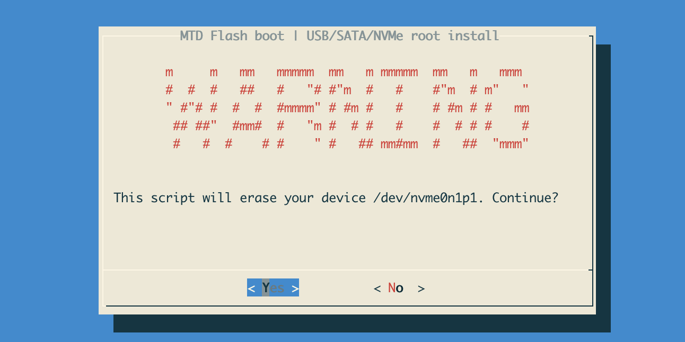
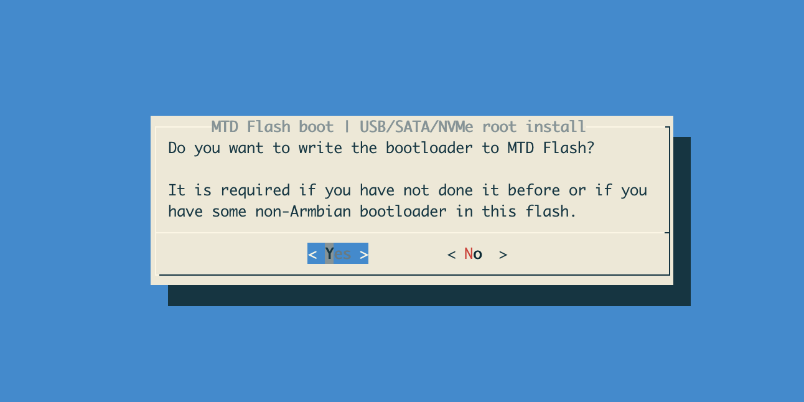
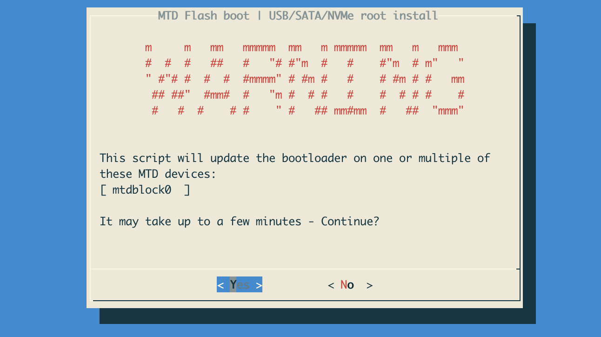

# **Create k3s cluster on OrangePi 5 plus devices with ansible** 

Readme contains explanations of some ansible cli commands that does initial
config and automated k3s config with ansible. 

## Manual actions

## Build Armbian for the OrangePI 5 Plus
You can skip this step and download image from the nearest mirror or continue
to building process with docker
(documentation):[https://docs.armbian.com/Developer-Guide_Building-with-Docker/]
```bash 
# Run docker container with the following command
./compile.sh docker-shell BOARD=orangepi5-plus \
    BUILD_MINIMAL=yes BUILD_DESKTOP=no  \
    KERNEL_CONFIGURE=no BRANCH=edge RELEASE=bookworm

# Run build process inside the container
./compile.sh BOARD=orangepi5-plus BUILD_MINIMAL=yes \
    BUILD_DESKTOP=no  KERNEL_CONFIGURE=no BRANCH=edge \
    RELEASE=bookworm EXTERNAL=yes DISABLE_IPV6=yes \
    FORCE_BOOTSCRIPT_UPDATE=yes MAINLINE_MIRROR=google
```

## Copy to sdcard (WARNING: doublecheck disk device name !!! )

```bash
# on osX check out the disk name with diskutil list command 
# on linux/bsd/unix you can use lsblk or parted or gsdisk or other like cdisk
# fdisk etc.

# create bootable sd card
sudo dd if=Armbian-unofficial_24.5.0-trunk_Orangepi5-plus_bookworm_edge_6.8.0-rc1_minimal.img \
    of=/dev/disk2 bs=1m status=progress
```

### Insert and Boot with SD card
Search for mac address of the device in your dhcp server and ssh
root@<ip_address> to it with default password "1234" 
Run fdisk in order to delete/create partitions

### Run armnbian-install and setup nvme0n1 as booting device
Choose from the menu





At the end it will ask you to poweroff. Do it remove SD card and you are done.

# Configure DHCP for static records or just leave it dynamic
After installing all devices Put it in the netwrok to get IP via DHCP (you can
do it with static records in it) and get ./ansible/inventory/hosts.ini update
with the correct IPs.   

# Running Ansible Playbooks for basic cobnfig
### Installing ansible requirements
```ansible
ansible-galaxy collection install -r collections/requirements.yml
```
### Copy pub keys
Role "copy-ssh-pub-key" is not working as expected!!! it's commented out (you
can use Copy ssh key from old playbooks blueprint)

```ansible
# Adding keys to cluster (expect to have key in ~/.ssh/id_rsa.pub)
# NOTE: will ask you for user password two times (TODO: fix this)

ansible-playbook -i inventory/hosts.ini k3s-ssh-copy-id.yml -e local_user=$USER -k

# NOTE: For removing use (suppose that pub keys are ~/.ssh/*.pub )
ansible-playbook -i inventory/hosts.ini k3s-ssh-remove-ssh-pub.yml -k
```

### Bootstrap
```ansible
ansible-playbook -i inventory/hosts.ini k3s-bootstrap.yml -K
```

### SSH config
```ansible
ansible-playbook -i inventory/hosts.ini k3s-sshd-hardened.yml -k --private-key=~/.ssh/id_rsa
```

### Installation - runs the folloing tasks
```text
On mater node: 
 Install K3s Master node
 Install k9s on master node
 Install Helm 
 Install Cilium with Helm
 Install cilium-cli
On nodes:
 Ensure the /etc/rancher/k3s directory exists
 Deploy the modified k3s.yaml to all nodes
 Install k3s on worker nodes
```
```ansible
ansible-playbook -i inventory/hosts.ini k3s-install.yml -K --private-key=~/.ssh/id_rsa -vvvv

# ansible-playbook -i inventory/hosts.ini k3s-install.yml -K --private-key=~/.ssh/id_rsa --limit="01.master.k3s"
```

## Old playbooks
### Copy ssh key 
That step supposes that you have already generated ssh key (~/.ssh/id_rsa*). I'll execute this one only for one of the devices (--limit=<ip_address>)
```ansible
ansible-playbook -i inventory/hosts.ini playbooks/00_copy_ssh_pub_key.yml  -k --limit="02.worker.k3s"
```

If you notice an error about sshpass just install it:
```bash
brew install hudochenkov/sshpass/sshpass
```
### Setup hostnames
Edit playbook mac addresses in order to specify hostnme for each device

```ansible
ansible-playbook -i ansible/inventory/hosts.ini \
    ./ansible/playbooks/00_set_hostname_by_mac_map.yml \
     --private-key=~/.ssh/id_rsa \
     -K \
     --limit="192.168.1.2"
```
### Update/upgrade
```ansible
ansible-playbook -i ansible/inventory/hosts.ini \
    ./ansible/playbooks/01_update_upgrade.yml \
     --private-key=~/.ssh/id_rsa \
     -K \
     --limit="k3s-master-01"
```

### Config SSH server and IPv6 ;))
```ansible
ansible-playbook -i ansible/inventory/hosts.ini \
    ./ansible/playbooks/02_sshd_config_hardened.yml \
     --private-key=~/.ssh/id_rsa \
     -K \
     --limit="k3s-master-01"
```
```ansible
ansible-playbook -i ansible/inventory/hosts.ini \
    ./ansible/playbooks/03_disable_ipv6.yml \
     --private-key=~/.ssh/id_rsa \
     -K \
     --limit="k3s-master-01"
```
```ansible
ansible-playbook -i ansible/inventory/hosts.ini \
    ./ansible/playbooks/04_disable_ipv6_nmcli.yml \
     --private-key=~/.ssh/id_rsa \
     -K \
     --limit="k3s-master-01"
```
### Print Load and reboot
```ansible
ansible-playbook -i ansible/inventory/hosts.ini \
    ./ansible/playbooks/05_load_status.yml \
     --private-key=~/.ssh/id_rsa \
     -K \
     --limit="k3s-master-01"
```
```ansible
ansible-playbook -i ansible/inventory/hosts.ini \
    ./ansible/playbooks/06_reboot.yml \
     --private-key=~/.ssh/id_rsa \
     -K \
     --limit="k3s-master-01"
```

## Optional helms

## TODOs
Place for roadmap ideas/

### Download armbian and check sha (localhost is osx TODO: for other osses) 
```ansible
# Executed in the local macOS to download and check image
ansible-playbook ./ansible/playbooks/TODO_001_download_verify_image.yml
```

### Write image to sdcard
This to be achiavable you need to set IMAGE_PATH and DISK_DEVICE.
WARNING: Make sure that disk is not wrong one!!
```ansible
# Executed in the local macOS for prepairng SD card 
ansible-playbook ./ansible/playbooks/TODO_002_resize_nvme0n1p2.yml
```


## Additional Cilium Config


