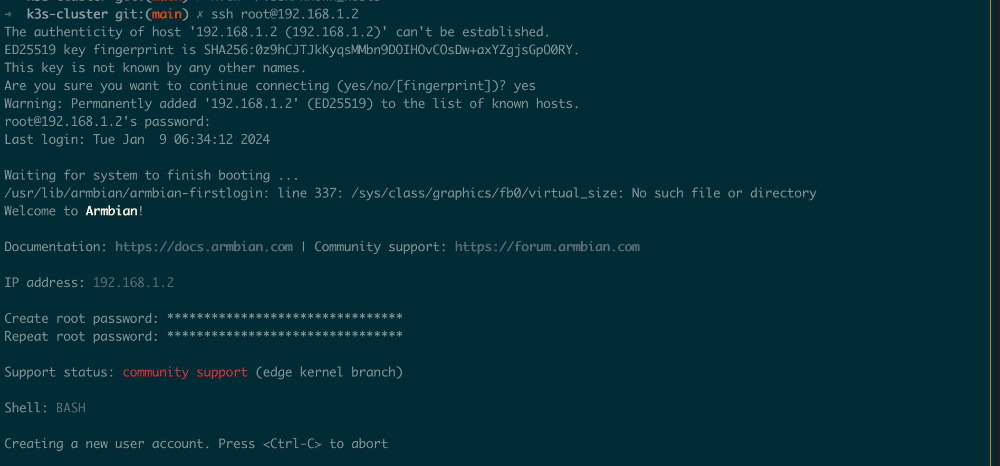
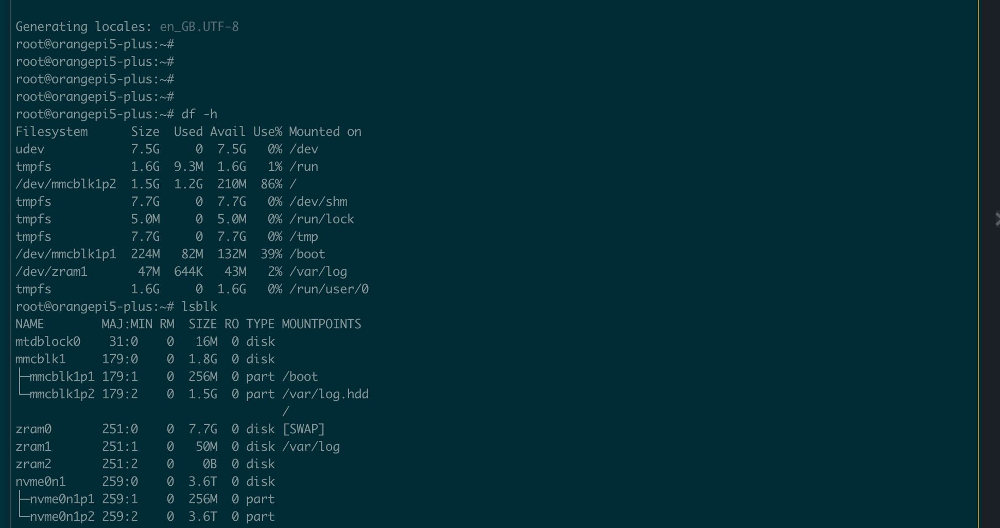
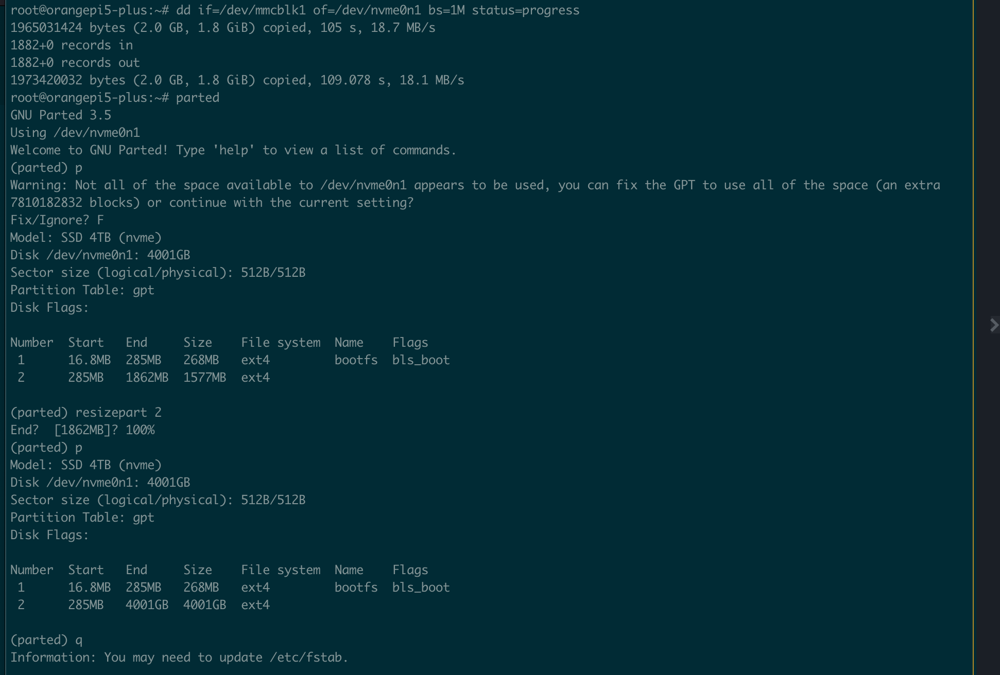
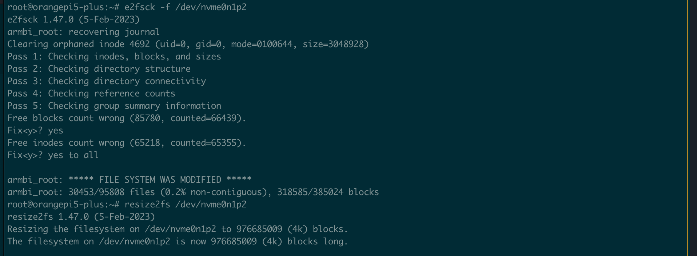
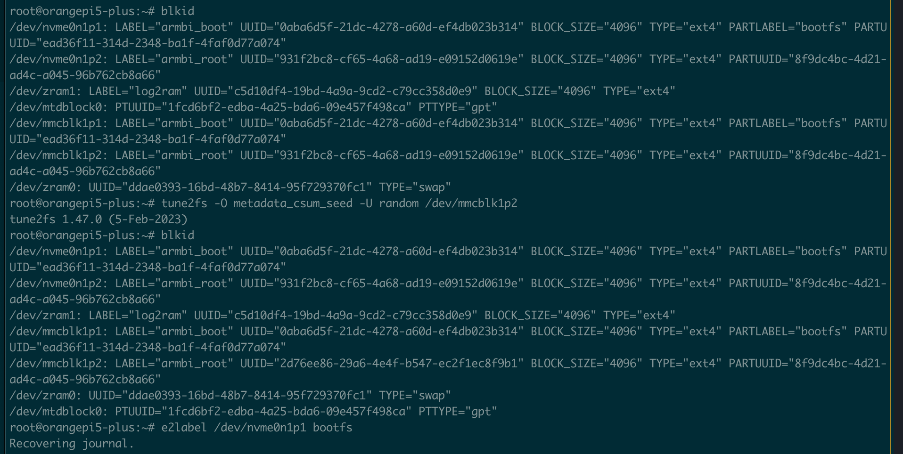
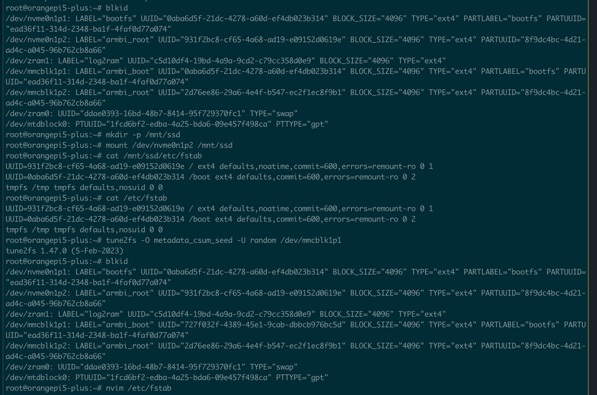
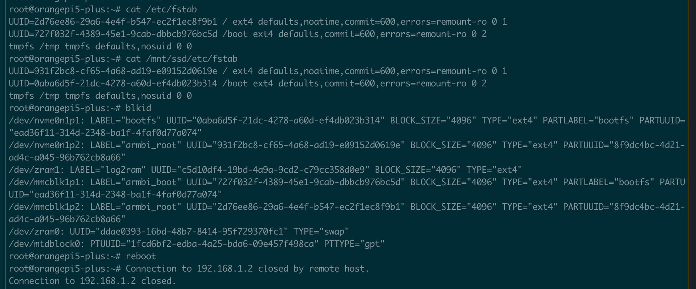

# **Create k3s cluster on OrangePi 5 plus devices with ansible** 

# Manual stuff (TODO: do it with playbooks.. someday)
It's supposed that you have SD card inserted as well as mounted nvme ssd disks mounted in the back of OrangePi 5 plus
The whole idea is to prepare and boot from SD card and move Armbian to the /dev/nvme0n1 sdd. 

## Copy to sdcard (WARNING: doublecheck disk device name !!! )
```bash
# on osX check out the disk name with diskutil list command 
# on linux/bsd/unix you can use lsblk or parted or gsdisk or other like cdisk fdisk etc.

# create bootable sd card
sudo dd if=Armbian_23.11.1_Orangepi5-plus_bookworm_edge_6.7.0-rc1_minimal.img of=/dev/disk2 bs=1m status=progress
```

### Insert and Boot with SD card

### List devices lsblk
```bash
lsblk
```


### On the device OrangePI 5 Plus DD from sd to nvme; Extend partition 2 (nvme0n1p2)
```bash
# WARNING: Ensure device name!!!
# root
sudo su -
# NOTE: option bs=1M is different from osX one (bs=1m) if you use it. 
dd if=/dev/mmcblk1 of=/dev/nvme0n1 bs=1M status=progress
```

### Check and resize fs 

```bash
e2fsck -f /dev/nvme0n1p2
resize2fs /dev/nvme0n1p2
```
### Check out that UUIDs of sdcard and nvme are the same.
```bash
blkid
```

### Change UUID 
```bash
tune2fs -O metadata_csum_seed -U random /dev/mmcblk1p2
e2label /dev/nvme0n1p1 bootfs
```
After changing UUIDs you must chage it in /etc/fstab accordingly. 
### Edit /etc/fstab in /dev/nvme0n1p1 (i.e. "/")


### Check and Reboot 



# Configure DHCP for static records or just leave it dynamic
After installing all devices Put it in the netwrok to get IP via DHCP (you can do it with static records in it) and get ./ansible/inventory/hosts.ini update with the correct IPs. 

# Running Ansible Playbooks for basic cobnfig
### Copy ssh key 
That step supposes that you have already generated ssh key (~/.ssh/id_rsa*). I'll execute this one only for one of the devices (--limit=<ip_address>)
```ansible
ansible-playbook -i ansible/inventory/hosts.ini \
    ./ansible/playbooks/00_copy_ssh_pub_key.yml \
     -k \
     --limit="192.168.1.2"
```
If you saw an error about sshpass just install it like that
```bash
brew install hudochenkov/sshpass/sshpass
```
### Setup hostnames
Edit playbook mac addresses in order to specify hostnme for each device

```ansible
ansible-playbook -i ansible/inventory/hosts.ini \
    ./ansible/playbooks/00_set_hostname_by_mac_map.yml \
     --private-key=~/.ssh/id_rsa \
     -K \
     --limit="192.168.1.2"
```
### Update/upgrade
```ansible
ansible-playbook -i ansible/inventory/hosts.ini \
    ./ansible/playbooks/01_update_upgrade.yml \
     --private-key=~/.ssh/id_rsa \
     -K \
     --limit="k3s-master-01"
```

### Config SSH server and IPv6 ;))
```ansible
ansible-playbook -i ansible/inventory/hosts.ini \
    ./ansible/playbooks/02_sshd_config_hardened.yml \
     --private-key=~/.ssh/id_rsa \
     -K \
     --limit="k3s-master-01"
```
```ansible
ansible-playbook -i ansible/inventory/hosts.ini \
    ./ansible/playbooks/03_disable_ipv6.yml \
     --private-key=~/.ssh/id_rsa \
     -K \
     --limit="k3s-master-01"
```
```ansible
ansible-playbook -i ansible/inventory/hosts.ini \
    ./ansible/playbooks/04_disable_ipv6_nmcli.yml \
     --private-key=~/.ssh/id_rsa \
     -K \
     --limit="k3s-master-01"
```
### Print Load and reboot
```ansible
ansible-playbook -i ansible/inventory/hosts.ini \
    ./ansible/playbooks/05_load_status.yml \
     --private-key=~/.ssh/id_rsa \
     -K \
     --limit="k3s-master-01"
```
```ansible
ansible-playbook -i ansible/inventory/hosts.ini \
    ./ansible/playbooks/06_reboot.yml \
     --private-key=~/.ssh/id_rsa \
     -K \
     --limit="k3s-master-01"
```
## TODOs
### Download armbian and check sha (localhost is osx TODO: for other osses) 
```ansible
# Executed in the local macOS to download and check image
ansible-playbook ./ansible/playbooks/TODO_001_download_verify_image.yml
```

### Write image to sdcard
This to be achiavable you need to set IMAGE_PATH and DISK_DEVICE.
WARNING: Make sure that disk is not wrong one!!
```ansible
# Executed in the local macOS for prepairng SD card 
ansible-playbook ./ansible/playbooks/TODO_002_resize_nvme0n1p2.yml
```
# Ansible Playbooks for installing Cilium
## TODO

# Ansible Playbooks for installing k3s
## TODO

# Ansible Playbooks for installing k8s
## TODO
