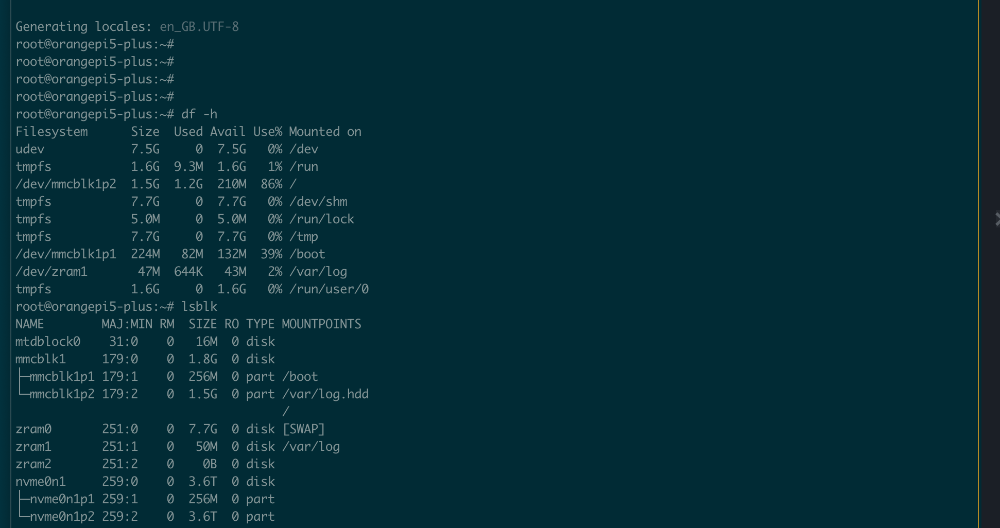
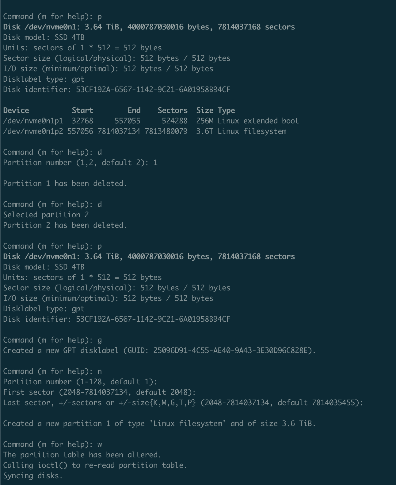
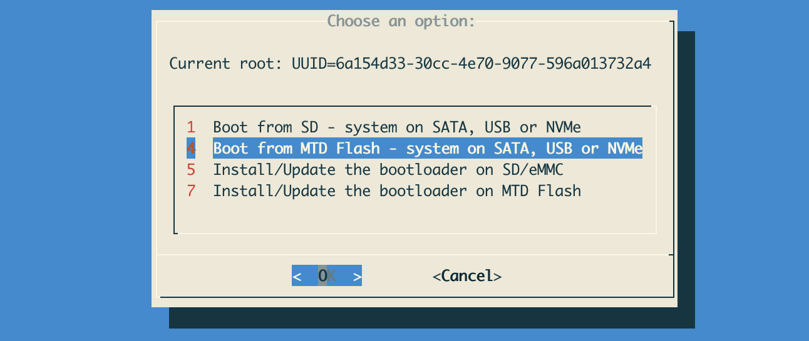
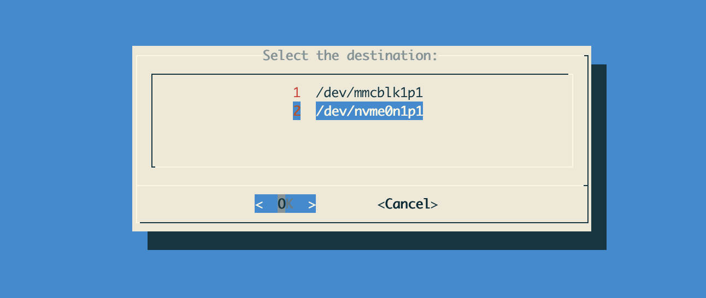
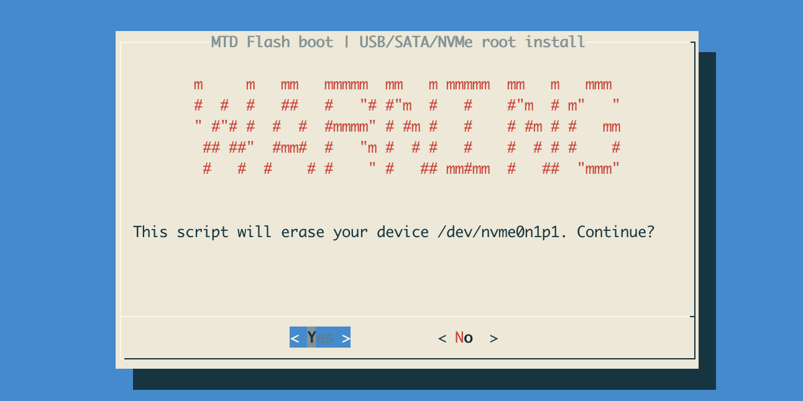
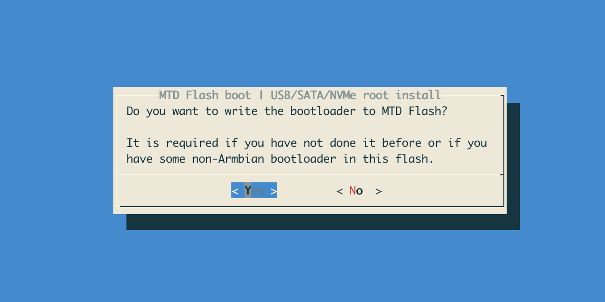
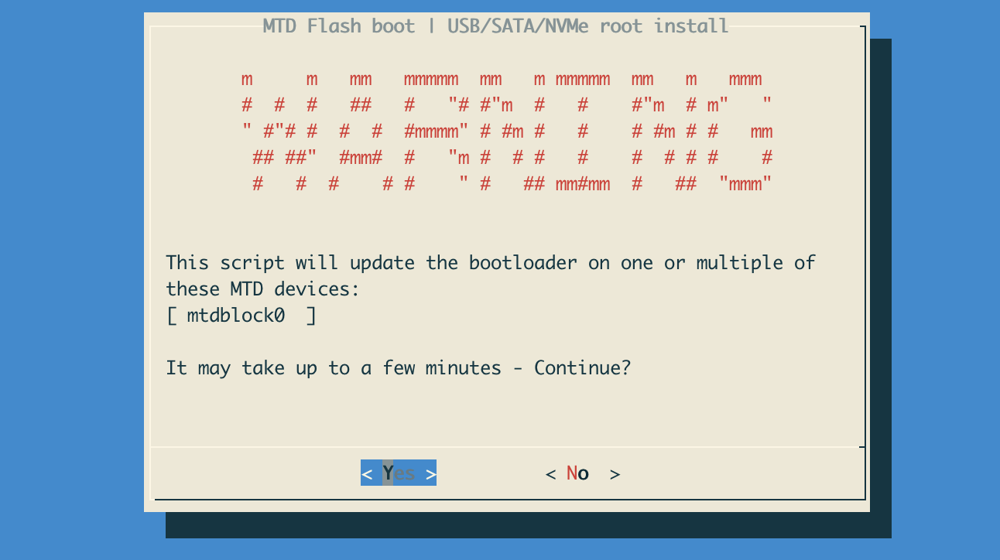

# **Create k3s cluster on OrangePi 5 plus devices with ansible** 

Explanations about installing k3s cluster on Orange Pi 5 Plus devices with
ansible. Process includes instalation of the following software:

```text
  Basic Software packages: 
	K3s
    k9s
    Helm 
    Cilium with Helm
    cilium-cli
  Additional Software packages:
    For testing purposes installation of open-webui project is done.
    modification of the helm chart are made because of the Cilium L2
    annoncements mode
```

## Manual actions

## Build Armbian for OrangePI 5 Plus devices
You can skip this step and download image from the nearest mirror or continue
to building process with docker

```bash
# Clone armbian repo go to the repo root
git clone https://github.com/armbian/build.git && cd build

# NOTE: running docker desktop app needs to be in place
# Run docker container with the following command
./compile.sh docker-shell BOARD=orangepi5-plus \
    BUILD_MINIMAL=yes BUILD_DESKTOP=no  \
    KERNEL_CONFIGURE=no BRANCH=edge RELEASE=bookworm

# Run build process inside the container
./compile.sh BOARD=orangepi5-plus BUILD_MINIMAL=yes \
    BUILD_DESKTOP=no  KERNEL_CONFIGURE=no BRANCH=edge \
    RELEASE=bookworm EXTERNAL=yes DISABLE_IPV6=yes \
    FORCE_BOOTSCRIPT_UPDATE=yes MAINLINE_MIRROR=google

# for more information https://docs.armbian.com/Developer-Guide_Building-with-Docker/
```

## Copy to sdcard (WARNING: doublecheck disk device name !!! )

```bash
# on osX check out the disk name with diskutil list command 
# on linux/bsd/unix you can use lsblk or parted or gsdisk or other like cdisk
# fdisk etc.

# create bootable sd card
sudo dd if=Armbian-unofficial_24.5.0-trunk_Orangepi5-plus_bookworm_edge_6.8.0-rc1_minimal.img \
    of=/dev/disk2 bs=1m status=progress
```

### Insert and Boot with SD card
Search for mac address of the device in your dhcp server and ssh
root@<ip_address> to it with default password "1234" 

### Fdisk - remove existing tables (if existing) and create one for the install
Check devices

Run fdisk in order to delete/create partitions

### Run armnbian-install and setup nvme0n1 as a booting device
Choose from the menu










At the end it will ask you to poweroff. Do it remove SD card and you are done.

# Configure DHCP for static records or just leave it dynamic
After installing all devices Put it in the netwrok to get IP via DHCP (you can
do it with static records in it) and get ./ansible/inventory/hosts.ini update
with the correct IPs.   

# Running Ansible Playbooks for basic cobnfig
### Installing ansible requirements
```ansible
ansible-galaxy collection install -r collections/requirements.yml
```
### Copy pub keys
Role "copy-ssh-pub-key" is not working as expected!!! it's commented out (you
can use Copy ssh key from old playbooks blueprint)

```ansible
# Adding keys to cluster (expect to have key in ~/.ssh/id_rsa.pub)
# NOTE: will ask you for user password two times (TODO: fix this)

ansible-playbook -i inventory/hosts.ini k3s-ssh-copy-id.yml -e local_user=$USER -k

# NOTE: For removing use (suppose that pub keys are ~/.ssh/*.pub )
ansible-playbook -i inventory/hosts.ini k3s-ssh-remove-ssh-pub.yml -k
```

### Bootstrap
```ansible
# Note: Before running bootstrap role you should change "mac_to_hostname" or just:
# comment out role 
#     - role: roles/set-hostname-by-mac-map
# located in k3s-bootstrap.yml file 

ansible-playbook -i inventory/hosts.ini k3s-bootstrap.yml -K
```

### SSH config
```ansible
ansible-playbook -i inventory/hosts.ini k3s-sshd-hardened.yml -k --private-key=~/.ssh/id_rsa
```

### Installation - runs the folloing tasks
```text
On mater node: 
 Install K3s Master node
 Install k9s on master node
 Install Helm 
 Install Cilium with Helm
 Install cilium-cli
On nodes:
 Ensure the /etc/rancher/k3s directory exists
 Modify and deploy the modified k3s.yaml to all nodes
 Install k3s on worker nodes
```

```ansible
ansible-playbook -i inventory/hosts.ini k3s-install.yml -K --private-key=~/.ssh/id_rsa -vvvv

# ansible-playbook -i inventory/hosts.ini k3s-install.yml -K --private-key=~/.ssh/id_rsa --limit="01.master.k3s"
```

# Configure cilium to use L2 annoncements for local Lan and create example deployment of ollama-webui helm chart

## Manifests

## Reconfig cilium to use L2 Anoncement for local Lan
This step is done via ansible helm installation of cilium 
check out ./ansible/roles/k3s-master-install/tasks/install_cilium_with_helm.yml

## RBAC needs to be in place in order cilium to have access to leases
```bash
# apply role, rolebinding to cilium service account that gives cilium accecss to "leases" resources
kubectl apply -f ./k8s-manifests/cilium-rbac-for-l2-annoncement.yml 
```

## Deploy Cilium lb pools
```bash
kubectl apply -f k3s-cluster/mainfests/lb-red-pool.yml
kubectl apply -f k3s-cluster/mainfests/lb-blue-pool.yml
```

## Inastall open-webui with helm  
```bash
# clone open-webui repo in ./k8s-manifests/
cd k8s-manifests/ && git clone https://github.com/zhecho/open-webui.git
cd open-webui/kubernetes/helm/

# Explanations about Cilium L2 annoncement mode
# Requirements: 
#   - there should be ip pool that is assigned to the service - this is
# achieved by setting label matching above pools (guarantied with color: blue
# tag) 
#
#   - service should have: 
#       spec.loadBalancerClass: io.cilium/l2-announcer
#       spec.type: LoadBalancer


# Test what should be deployed with helm template cli command:

helm template ollama ./\
    --set webui.service.labels.color="blue"\
    --set webui.service.type="LoadBalancer"\
    --set webui.service.loadBalancerClass="io.cilium/l2-announcer"

# install it 
helm install ollama ./\
    --set webui.service.labels.color="blue"\
    --set webui.service.type="LoadBalancer"\
    --set webui.service.loadBalancerClass="io.cilium/l2-announcer"


```

## Accessing cluster with ssh && k9s
```bash
# Login 
ssh $USER@<k3s_master_ip> && sudo su -
# Export env in order k9s to know config file
export KUBECONFIG=/etc/rancher/k3s/k3s.yaml
# Run k9s
k9s
```


## TODOs
Place for roadmap ideas/


